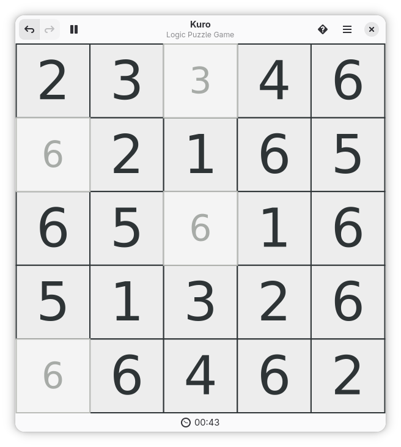
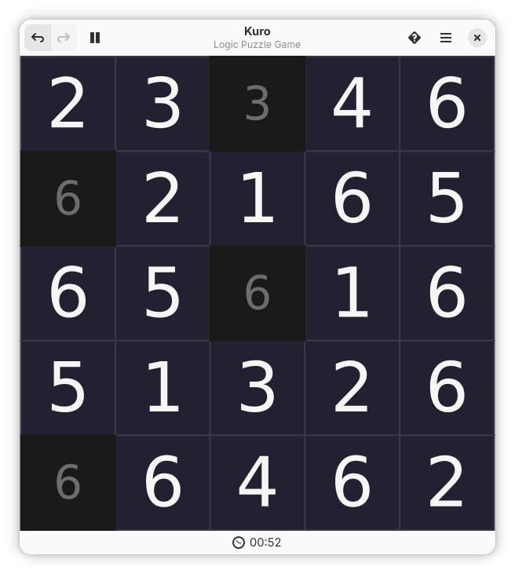
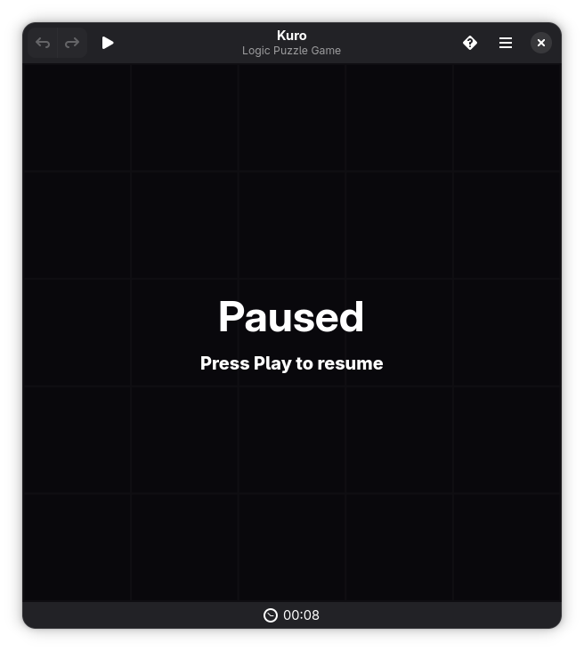
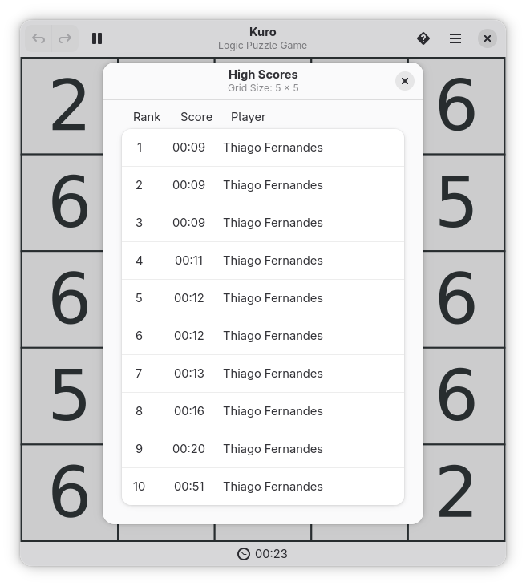
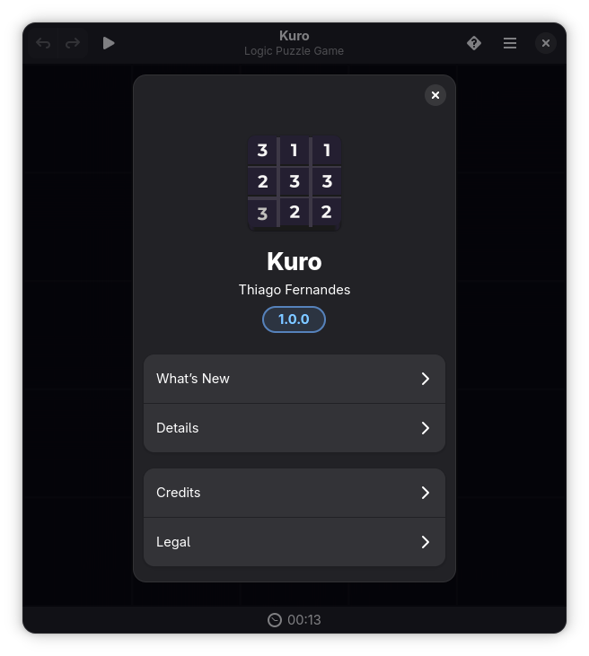
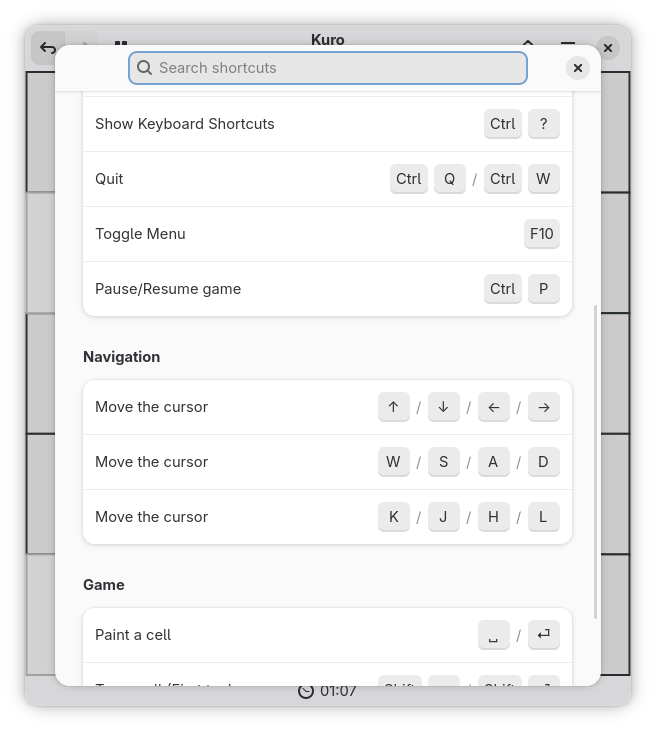
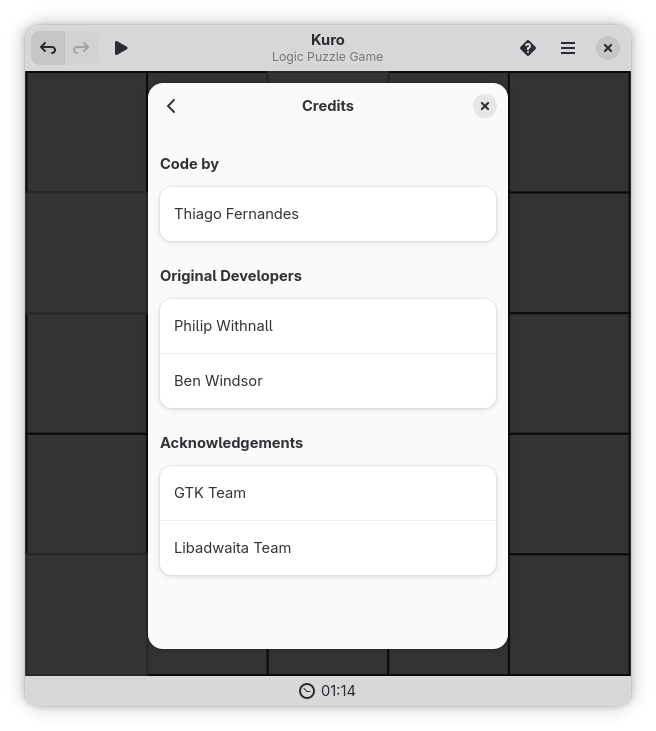

# Kuro

A modern, native GTK4 implementation of the Hitori logic puzzle game for GNOME.

<div align="center">



<a href="https://flathub.org/apps/io.github.tobagin.Kuro"></a>

</div>


## 🎉 Version 1.0.0 - Reimagined for GNOME

**Kuro 1.0.0** is a major release that modernizes the classic Hitori game with a fresh new look and feel.

### ✨ Key Features

- **🚀 Native GTK4 & Libadwaita**: Built with the latest GNOME technologies for a seamless, modern experience.
- **⏸️ Pause Overlay**: A new, centralized pause screen that hides the board to prevent cheating.
- **⌨️ Keyboard Support**: Play entirely with your keyboard using arrow keys, WASD, or HJKL.
- **🎨 Auto Theme**: Automatically adapts to your system's light or dark mode preference.
- **📏 Multiple Board Sizes**: Choose from 5x5 up to 10x10 grids to match your skill level.
- **UNDO/REDO**: Make mistakes without worry with full undo/redo support.

### 🆕 What's New in 1.0.0

- **Fork of Hitori**: Rebuilt and rebranded as a standalone modern application.
- **UI Overhaul**: Complete transition to Blueprint and Libadwaita.
- **Headerbar Subtitle**: Added "GTK4 Hitori game" subtitle for context.
- **Enhanced Preferences**: integrated directly into the primary menu.

For detailed release notes and version history, see [CHANGELOG.md](CHANGELOG.md).

## Building from Source

```bash
# Clone the repository
git clone https://github.com/tobagin/Kuro.git
cd Kuro

# Build and install development version
./build.sh --dev
```

## Usage

### Basic Usage

Launch Kuro from your applications menu or run:
```bash
flatpak run io.github.tobagin.Kuro
```

1.  **Rule 1**: No number can appear more than once in a row or column.
2.  **Rule 2**: Painted cells cannot touch horizontally or vertically.
3.  **Rule 3**: All unpainted cells must be connected in a single group.

### Keyboard Controls

- **Arrow Keys / WASD / HJKL**: Move cursor.
- **Enter / Space**: Toggle cell state (Unpainted -> Painted -> Tag 1 -> Tag 2).
- **Ctrl+Z**: Undo.
- **Ctrl+Shift+Z**: Redo.
- **Ctrl+P**: Pause/Resume.
- **Ctrl+N**: New Game.
- **Ctrl+Q**: Quit.

## Privacy & Security

Kuro is designed to respect your privacy:

- **Sandboxed**: Distributed as a Flatpak with strict permissions.
- **Local Data**: All game progress and configuration is stored locally.
- **Open Source**: Code is fully available for audit.

## Contributing

Contributions are welcome! Please feel free to open issues or submit pull requests.

- Reporting Bugs: [GitHub Issues](https://github.com/tobagin/Kuro/issues)

## License

Kuro is licensed under the [GPL-3.0-or-later](COPYING).

## Acknowledgments

- **Original Hitori Developers**: Philip Withnall, Ben Windsor.
- **GNOME**: For the GTK toolkit and Libadwaita.
- **Nikoli**: For the original Hitori puzzle design.

## Screenshots

| Dark Theme | Pause Overlay |
|------------|---------------|
|  |  |

| High Scores | About Dialog |
|-------------|--------------|
|  |  |

| Keyboard Shortcuts | Credits |
|--------------------|---------|
|  |  |
